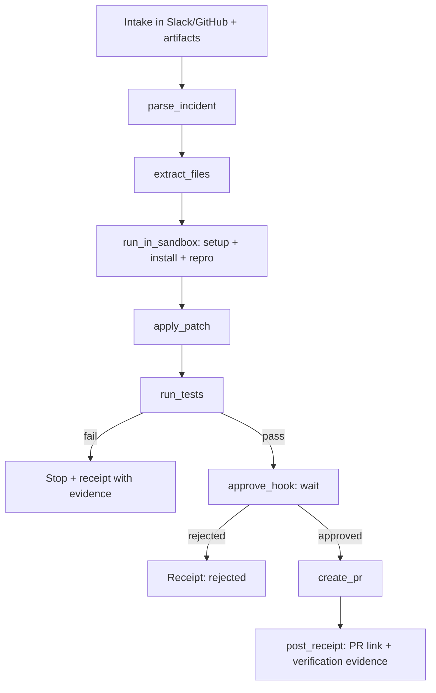

# PatchPilot: Incident-to-PR Verified Fix Agent

## Executive summary

“PatchPilot” is a hackathon-favored **end-to-end agent** that turns messy real-world incident artifacts (stack traces, logs, screenshots, PDFs) into a **verified code change** and a **human-approved pull request**, with **durability, safety, and observability** built in by design. The winning signal here is not “chat about an error,” but: **ingest → reason → act → verify → gate → ship → receipt**. That maps extremely cleanly onto a modern Vercel-sponsored agent stack: **Chat SDK** for distribution across Slack/GitHub, **Sandbox** for safe execution, **Workflow DevKit** for durable orchestration + approvals, **AI Gateway + AI SDK** for model reliability and fallbacks, and partner tools for production-grade feel: **Supabase** (state + realtime run traces), **Better Auth** (authN/authZ + approvals), **Sentry** (agent/tool-call monitoring), **ElevenLabs** (voice surface), and **Augment Code** (codebase indexing as a differentiator vs generic RAG). citeturn17view3turn6view0turn34view0turn15view1turn26view0turn12view0turn25view0turn27view0turn38view0

The implementation plan below is intentionally “thin-slice first”: ship a credible PatchPilot loop by midday (artifact → sandbox repro → patch → green tests → approval → PR), then add the **minimal** Agent Foundry and VoiceOps “surfaces” as wrappers around the same core workflow so the product feels inevitable—not like three separate demos. citeturn34view1turn35view0turn30view1turn36view4

## Sponsor-maximized system architecture and tech stack

### High-level architecture

```mermaid
flowchart LR
  subgraph Clients
    S[Slack thread] -->|Chat SDK webhook| N[Next.js API]
    G[GitHub PR/Issue comment] -->|Chat SDK webhook| N
    W[Web dashboard] --> N
    V[Voice UI] -->|ElevenLabs STT WS| E1[ElevenLabs]
    V --> N
  end

  N -->|start()| WF[Workflow DevKit run]
  WF -->|steps| AI[AI SDK + AI Gateway]
  WF -->|create sandbox| SB[Vercel Sandbox]
  SB -->|git clone + tests| R[(Repo workspace)]
  WF --> DB[(Supabase Postgres)]
  DB --> RT[Supabase Realtime]
  RT --> W

  WF -->|approval hook| AP[Approval endpoint]
  AP -->|resume()| WF

  WF -->|create PR| GH[GitHub API]
  WF -->|receipt| S
  WF -->|receipt| G
  WF -->|telemetry| SE[Sentry]
  V -->|ElevenLabs TTS WS| E2[ElevenLabs]
```

This arrangement follows the durable-workflow model where **work happens in steps**; long waits (approvals) suspend without compute; and Sandboxed execution is isolated and verifiable. citeturn34view0turn36view4turn35view0turn6view2turn26view0

### Tech stack mapping (packages, imports, model strings, endpoints, config keys)

| Component                    | Package / Import (TypeScript)                                   | Purpose in PatchPilot                                                                                                                    | Key config keys / endpoints                                                                                                                                                                                           |
| ---------------------------- | --------------------------------------------------------------- | ---------------------------------------------------------------------------------------------------------------------------------------- | --------------------------------------------------------------------------------------------------------------------------------------------------------------------------------------------------------------------- |
| Next.js app (App Router)     | `next`                                                          | Web UI + API routes + Chat SDK webhooks + auth endpoints                                                                                 | `NEXT_PUBLIC_APP_URL` (unspecified), standard Next.js deployment                                                                                                                                                      |
| Durable runtime              | `workflow`, `workflow/next`, `workflow/api`                     | `"use workflow"` / `"use step"` durable orchestration; `start()` launches runs; run streaming via `run.readable` and `run.getReadable()` | `withWorkflow(nextConfig)`; `start(workflowFn, args)`; optional `npx workflow web` for run inspection citeturn34view0turn34view1turn36view4                                                                      |
| Human approvals              | `defineHook` from `workflow`                                    | Hard gate before side-effectful actions like PR creation; hook token = toolCallId pattern                                                | `defineHook({ schema })`; `hook.create({ token })`; `hook.resume(token, data)` citeturn35view0turn4view3                                                                                                          |
| Safe execution               | `@vercel/sandbox` (`import { Sandbox } from "@vercel/sandbox"`) | Ephemeral microVM execution; verifiable repro/tests; file edits in isolation                                                             | Sandbox auth via `VERCEL_OIDC_TOKEN` pulled by `vercel env pull`; snapshots via `sandbox.snapshot()`; restore via `Sandbox.create({ source: {type:"snapshot"}})` citeturn6view0turn8view0turn3view3              |
| Sandbox egress safety        | `sandbox.updateNetworkPolicy()` / `sandbox.setNetworkPolicy()`  | Lock outbound network after installs; prevent exfil; credential brokering when needed                                                    | Allowlist domains; credential brokering injects headers at firewall so secrets never enter sandbox citeturn6view0turn6view1turn6view2                                                                            |
| Multi-platform chat          | `chat` (`import { Chat } from "chat"`)                          | One bot logic for Slack + GitHub; thread-based UX; button approvals                                                                      | Webhook handler via `bot.webhooks[platform]`; `thread.post()`, `thread.subscribe()` citeturn20view0turn19view1turn17view3                                                                                        |
| Slack adapter                | `@chat-adapter/slack` (`createSlackAdapter`)                    | Incident intake + receipts + approval buttons in Slack                                                                                   | `SLACK_BOT_TOKEN`, `SLACK_SIGNING_SECRET`; optional OAuth mode + token encryption citeturn23view1turn20view0                                                                                                      |
| GitHub adapter               | `@chat-adapter/github` (`createGitHubAdapter`)                  | Intake from PR/issue comments; post receipts back to PR                                                                                  | `GITHUB_TOKEN` _or_ GitHub App (`GITHUB_APP_ID`, `GITHUB_PRIVATE_KEY`, optional `GITHUB_INSTALLATION_ID`), plus `GITHUB_WEBHOOK_SECRET`, `GITHUB_BOT_USERNAME` citeturn23view0                                     |
| Chat state on Postgres       | `@chat-adapter/state-pg` (`createPostgresState`)                | Durable subscriptions + distributed locks using Postgres (fits Supabase)                                                                 | Reads `POSTGRES_URL` / `DATABASE_URL`; auto-creates tables on connect citeturn18view0turn17view0turn17view1                                                                                                      |
| AI orchestration toolkit     | `ai` (`generateText`, `streamText`, tools)                      | Tool-calling, structured outputs, streaming tokens/reasoning                                                                             | Enable AI SDK telemetry integrations; pass `providerOptions` for reasoning configs citeturn15view1turn25view3turn30view0                                                                                         |
| Reliability + routing        | AI Gateway via `@ai-sdk/gateway` (`createGateway`)              | One endpoint, budgets/monitoring/fallback models; demo insurance if provider hiccups                                                     | Base URL documented as `https://ai-gateway.vercel.sh/v1/ai` for AI SDK; OpenAI-compatible base URL `https://ai-gateway.vercel.sh/v1`; `AI_GATEWAY_API_KEY` citeturn15view2turn15view0turn15view1                 |
| Primary model                | `model: "google/gemini-3.1-pro-preview"` (AI Gateway)           | Multimodal + long context + tool use; optimized for agentic workflows                                                                    | Gemini 3.1 Pro Preview supports multimodal inputs and very large context; custom tools endpoint exists as `gemini-3.1-pro-preview-customtools` (direct Gemini/Vertex) citeturn14view1turn33search1                |
| Thinking control             | `providerOptions.vertex.thinkingConfig`                         | Control latency vs depth; optionally include thoughts for debugging                                                                      | Example: `thinkingLevel: "high"`, `includeThoughts: true` in provider options for Gemini 3/3.1 citeturn30view0turn14view2                                                                                         |
| Supabase                     | `@supabase/supabase-js` (`createClient`)                        | Persistent run history, artifacts, approvals, PR records; realtime run traces                                                            | Realtime Postgres Changes via `.channel(...).on("postgres_changes", ...)`; must enable replication for listened tables citeturn26view0turn26view1                                                                 |
| AuthN/AuthZ                  | `better-auth`, `better-auth/next-js`, plugins                   | Secure dashboard; approval + PR creation permission checks                                                                               | `BETTER_AUTH_SECRET`, `BETTER_AUTH_URL`; Next.js handler `toNextJsHandler(auth)`; access control via `createAccessControl` + admin plugin roles citeturn9view0turn9view1turn12view0                              |
| Observability                | `@sentry/nextjs` + `vercelAIIntegration`                        | Trace agent runs, tool calls, token usage, errors; “Agent Run Trace” view for judges                                                     | Sentry AI Agent Monitoring tracks token usage/latency/tool usage; `recordInputs`/`recordOutputs` privacy toggles; Vercel AI integration instruments AI SDK citeturn25view0turn24search2turn25view2               |
| Voice surface                | ElevenLabs WebSockets                                           | VoiceOps: STT realtime + TTS streaming; posts receipt to Slack                                                                           | STT WS: `wss://api.elevenlabs.io/v1/speech-to-text/realtime` with `model_id`; send `input_audio_chunk`; TTS WS stream-input endpoint and base64 `audio` chunks citeturn27view0turn28view4turn28view1turn28view0 |
| Code indexing differentiator | `@augmentcode/auggie-sdk`                                       | Fast “what files matter?” retrieval + context export/import to avoid re-indexing                                                         | `DirectContext.create()`, `addToIndex`, `search`, `searchAndAsk`, `exportToFile`; auth via `AUGMENT_API_TOKEN`/`AUGMENT_API_URL` or CLI session citeturn38view0turn38view1                                        |

### Environment variables (.env template)

```bash
# --- App ---
NEXT_PUBLIC_APP_URL=http://localhost:3000  # unspecified for production

# --- Workflow DevKit (usually no special env needed beyond platform) ---
# (If any WDK-specific env is required in your deployment, it is unspecified here.)

# --- Vercel Sandbox auth ---
VERCEL_OIDC_TOKEN=                         # populated by: vercel env pull citeturn6view0

# --- AI Gateway (recommended path) ---
AI_GATEWAY_API_KEY=vck_xxxxxx              # AI Gateway API key citeturn15view0turn15view2

# --- Direct Gemini API fallback (optional) ---
GOOGLE_GENERATIVE_AI_API_KEY=              # used by @ai-sdk/google provider citeturn14view3

# --- Chat SDK (Slack) ---
SLACK_BOT_TOKEN=xoxb-...                   # single-workspace mode citeturn23view1turn20view0
SLACK_SIGNING_SECRET=...

# --- Chat SDK (GitHub) ---
GITHUB_WEBHOOK_SECRET=...
GITHUB_BOT_USERNAME=patchpilot
# Prefer GitHub App (recommended by Chat SDK docs):
GITHUB_APP_ID=
GITHUB_PRIVATE_KEY="-----BEGIN ... -----END ... -----"
GITHUB_INSTALLATION_ID=                    # optional for multi-tenant citeturn23view0

# --- Postgres (Supabase) ---
POSTGRES_URL=postgres://...                # used by @chat-adapter/state-pg citeturn18view0
SUPABASE_URL=https://<project>.supabase.co
SUPABASE_ANON_KEY=sb_publishable_...
SUPABASE_SERVICE_ROLE_KEY=sb_secret_...

# --- Better Auth ---
BETTER_AUTH_SECRET=                        # >= 32 chars citeturn9view1
BETTER_AUTH_URL=http://localhost:3000      # update in prod citeturn9view1

# --- Sentry ---
SENTRY_DSN=
SENTRY_AUTH_TOKEN=                         # for sourcemaps in CI (optional)

# --- ElevenLabs ---
ELEVENLABS_API_KEY=

# --- Augment Code (optional; CLI login supported) ---
AUGMENT_API_TOKEN=
AUGMENT_API_URL=https://<tenant>.api.augmentcode.com  # format per docs citeturn38view0
```

## Durable workflow design and tool schemas

### Workflow principles for a judge-winning agent

PatchPilot should behave like a **systems product**, not a script:

- **Durability**: Use `"use workflow"` + `"use step"` so multi-step execution survives restarts; steps retry on unhandled errors; `sleep()` is resource-free suspension. citeturn34view0turn34view1
- **Explicit gating**: If a tool call has “significant consequences,” validate with the user before executing. (In PatchPilot: PR creation, pushing commits, modifying a repo.) citeturn14view2turn35view0
- **Observability**: stream progress to UI (`Run.readable`, `run.getReadable`) and persist run events to Supabase realtime so failures are debuggable live. citeturn36view4turn26view0turn25view0

### Workflow step table (thin slice)

| Step name               | Input                         | Output                          | Tool calls used                              | Approval required         |
| ----------------------- | ----------------------------- | ------------------------------- | -------------------------------------------- | ------------------------- |
| intake_and_parse        | incident text + artifact refs | structured incident JSON        | `parse_incident`                             | No                        |
| locate_files            | repo + incident JSON          | candidate files + rationale     | `extract_files`                              | No                        |
| sandbox_repro_and_patch | repo snapshot + plan          | patch diff + before/after logs  | `run_in_sandbox`, `apply_patch`, `run_tests` | No                        |
| request_pr_approval     | patch + evidence              | approval token + pending status | `approve_hook`, `post_receipt`               | **Yes**                   |
| create_pull_request     | approved + patch              | PR URL + metadata               | `create_pr`                                  | (gated by prior approval) |
| final_receipt           | PR + evidence                 | posted messages                 | `post_receipt`                               | No                        |

### Complete Workflow DevKit definition (step-by-step pseudocode)

Below is the intended durable orchestration shape. It follows the official Next.js Workflow DevKit patterns: wrap Next config with `withWorkflow`, start runs via `start()` in an API route, and implement step functions with `"use step"` while the workflow orchestrator uses `"use workflow"`. citeturn34view0turn34view1turn36view4

```ts
// workflows/patchpilot.ts
import { FatalError } from "workflow";
import { prApprovalHook } from "@/workflows/hooks/pr-approval";

// NOTE: This is pseudocode; exact helper implementations are in the scaffolding section.

export type PatchPilotWorkflowInput = {
  runId: string;
  repo: {
    owner: string;
    name: string;
    defaultBranch: string; // unspecified if not provided
    installationId?: number; // optional multi-tenant GitHub App
  };
  incident: {
    summaryText: string;
    artifacts: Array<{
      kind: "log" | "screenshot" | "pdf" | "other";
      // stored object reference in Supabase storage or external URL
      ref: string;
      mimeType?: string;
    }>;
  };
  config: {
    testCommand: string; // e.g. "pnpm test" (unspecified per-repo)
    buildCommand?: string; // optional
    packageManager?: "pnpm" | "npm" | "yarn"; // unspecified
    maxAgentIterations: number; // e.g. 2
  };
};

export async function patchPilotIncidentToPR(input: PatchPilotWorkflowInput) {
  "use workflow";

  // 0) Create a "run" record and emit initial trace
  await emitRunEvent({ runId: input.runId, type: "run.started", data: input });

  // 1) Parse incident into structured form (LLM-assisted step)
  const parsed = await parseIncidentStep(input);
  await emitRunEvent({
    runId: input.runId,
    type: "incident.parsed",
    data: parsed,
  });

  // 2) Identify likely files (Augment + fallback grep)
  const focus = await extractFilesStep({ repo: input.repo, parsed });
  await emitRunEvent({ runId: input.runId, type: "repo.focus", data: focus });

  // 3) Sandboxed reproduction + patch + verification
  const verification = await sandboxFixStep({
    repo: input.repo,
    parsed,
    focus,
    config: input.config,
  });

  await emitRunEvent({
    runId: input.runId,
    type: "verification.done",
    data: verification,
  });

  if (verification.tests.status !== "pass") {
    // Thin-slice behavior: do not open PR if tests are red.
    // Consider one retry iteration if time allows (input.config.maxAgentIterations).
    throw new FatalError("Verification failed: tests are not green");
  }

  // 4) Human approval gate (HOOK; no compute while waiting)
  // Token strategy: use verification.toolCallId or derived id as token (pattern from docs)
  const hook = prApprovalHook.create({ token: verification.approvalToken });

  await postReceiptStep({
    runId: input.runId,
    destination: verification.receiptDestination,
    message: buildApprovalCardMessage(verification),
  });

  const decision = await hook; // pauses workflow until resume() called
  await emitRunEvent({
    runId: input.runId,
    type: "approval.resolved",
    data: decision,
  });

  if (!decision.approved) {
    await postReceiptStep({
      runId: input.runId,
      destination: verification.receiptDestination,
      message: `PR creation rejected: ${decision.comment ?? "no comment"}`,
    });
    return { runId: input.runId, status: "rejected" as const };
  }

  // 5) Create PR (server-side; should not expose write tokens to sandbox)
  const pr = await createPrStep({
    repo: input.repo,
    patch: verification.patch,
    evidence: verification.evidence,
    title: verification.prTitle,
    body: verification.prBody,
  });

  await emitRunEvent({ runId: input.runId, type: "pr.created", data: pr });

  // 6) Final receipt
  await postReceiptStep({
    runId: input.runId,
    destination: verification.receiptDestination,
    message: buildFinalReceipt(verification, pr),
  });

  return { runId: input.runId, status: "pr_created" as const, pr };
}

// Example step shape (business logic in steps; retried on errors)
async function parseIncidentStep(input: PatchPilotWorkflowInput) {
  "use step";
  // Calls Gemini via AI Gateway; uses temperature 0 and structured output.
  return await parse_incident({ runId: input.runId, incident: input.incident });
}
```

This design mirrors the official guidance that steps are where external work happens and are retried, while workflows orchestrate and can suspend cheaply. citeturn34view0turn34view1turn35view0

### Tool schemas (function signatures + JSON Schemas)

These schemas are designed to be usable in three places simultaneously:

1. **AI SDK tool calling** (Zod → JSON schema-like constraints) citeturn14view2turn25view3
2. **Gemini function calling** using the OpenAPI-compatible declaration subset citeturn37view4turn14view2
3. **Workflow step inputs** (must be serializable) citeturn34view1

#### `parse_incident`

**Signature**

```ts
async function parse_incident(input: {
  runId: string;
  incident: {
    summaryText: string;
    artifacts: Array<{ kind: string; ref: string; mimeType?: string }>;
  };
}): Promise<{
  normalizedSummary: string;
  suspectedRootCause: string;
  severity: "sev0" | "sev1" | "sev2" | "unknown";
  likelyComponents: string[];
  reproductionRecipe: { steps: string[]; expected: string; notes?: string };
  constraints: { mustNotDo: string[]; assumptions: string[] };
}>;
```

**Parameters JSON Schema**

```json
{
  "type": "object",
  "properties": {
    "runId": { "type": "string" },
    "incident": {
      "type": "object",
      "properties": {
        "summaryText": { "type": "string" },
        "artifacts": {
          "type": "array",
          "items": {
            "type": "object",
            "properties": {
              "kind": {
                "type": "string",
                "enum": ["log", "screenshot", "pdf", "other"]
              },
              "ref": { "type": "string" },
              "mimeType": { "type": "string" }
            },
            "required": ["kind", "ref"]
          }
        }
      },
      "required": ["summaryText", "artifacts"]
    }
  },
  "required": ["runId", "incident"]
}
```

**Return JSON Schema (abbrev)**

```json
{
  "type": "object",
  "properties": {
    "normalizedSummary": { "type": "string" },
    "suspectedRootCause": { "type": "string" },
    "severity": {
      "type": "string",
      "enum": ["sev0", "sev1", "sev2", "unknown"]
    },
    "likelyComponents": { "type": "array", "items": { "type": "string" } },
    "reproductionRecipe": {
      "type": "object",
      "properties": {
        "steps": { "type": "array", "items": { "type": "string" } },
        "expected": { "type": "string" },
        "notes": { "type": "string" }
      },
      "required": ["steps", "expected"]
    },
    "constraints": {
      "type": "object",
      "properties": {
        "mustNotDo": { "type": "array", "items": { "type": "string" } },
        "assumptions": { "type": "array", "items": { "type": "string" } }
      },
      "required": ["mustNotDo", "assumptions"]
    }
  },
  "required": [
    "normalizedSummary",
    "suspectedRootCause",
    "severity",
    "likelyComponents",
    "reproductionRecipe",
    "constraints"
  ]
}
```

#### `extract_files`

Uses Augment indexing as the “not just embeddings” differentiator; supports exporting state to avoid re-indexing. citeturn38view0turn38view1

**Signature**

```ts
async function extract_files(input: {
  runId: string;
  repo: { owner: string; name: string; defaultBranch: string };
  parsedIncident: {
    suspectedRootCause: string;
    likelyComponents: string[];
    reproductionRecipe: { steps: string[] };
  };
  strategy: { useAugment: boolean; fallbackRipgrep: boolean };
}): Promise<{
  candidates: Array<{ path: string; reason: string; confidence: number }>;
  searchNotes: string[];
}>;
```

**Parameters JSON Schema**

```json
{
  "type": "object",
  "properties": {
    "runId": { "type": "string" },
    "repo": {
      "type": "object",
      "properties": {
        "owner": { "type": "string" },
        "name": { "type": "string" },
        "defaultBranch": { "type": "string" }
      },
      "required": ["owner", "name", "defaultBranch"]
    },
    "parsedIncident": { "type": "object" },
    "strategy": {
      "type": "object",
      "properties": {
        "useAugment": { "type": "boolean" },
        "fallbackRipgrep": { "type": "boolean" }
      },
      "required": ["useAugment", "fallbackRipgrep"]
    }
  },
  "required": ["runId", "repo", "parsedIncident", "strategy"]
}
```

#### `run_in_sandbox`

Sandbox is Firecracker-isolated microVM execution with optional network controls. citeturn6view2turn6view0

**Signature**

```ts
async function run_in_sandbox(input: {
  runId: string;
  repoClone: {
    url: string;
    // For private repos, use x-access-token username + short-lived token password
    username?: string;
    password?: string;
    depth?: number;
  };
  runtime: "node24" | "python3.13"; // runtime strings documented in Sandbox SDK reference
  snapshotId?: string;
  commands: Array<{ name: string; cmd: string; timeoutMs: number }>;
  networkPolicyPhase?:
    | "install-open"
    | "deny-all-after-install"
    | "allowlist-only";
}): Promise<{
  sandboxId: string;
  commandResults: Array<{
    name: string;
    exitCode: number;
    stdout: string;
    stderr: string;
    durationMs: number;
  }>;
}>;
```

#### `apply_patch`

Patch application is done inside the sandbox for verification, but **PR creation is server-side**.

**Signature**

```ts
async function apply_patch(input: {
  runId: string;
  sandboxId: string;
  patch: { unifiedDiff: string };
}): Promise<{
  applied: boolean;
  diffAfter: string;
  changedFiles: string[];
}>;
```

#### `run_tests`

**Signature**

```ts
async function run_tests(input: {
  runId: string;
  sandboxId: string;
  testCommand: string;
  timeoutMs: number;
}): Promise<{
  status: "pass" | "fail";
  exitCode: number;
  stdout: string;
  stderr: string;
  summary: { failingTests?: number; notes: string[] };
}>;
```

#### `approve_hook`

Hook mechanics follow the official “token = toolCallId” pattern and resume via an API route calling `hook.resume()`. citeturn35view0turn4view3

**Signature**

```ts
async function approve_hook(input: {
  token: string; // toolCallId-like identifier
  runId: string;
  prPreview: { title: string; body: string; diffStat: string };
}): Promise<{ approved: boolean; comment?: string }>;
```

#### `create_pr`

Create PR should be validated-by-design (requires approved gate). Vertex AI guidance recommends validating “significant consequence” tool calls with the user. citeturn14view2turn35view0

**Signature**

```ts
async function create_pr(input: {
  runId: string;
  repo: { owner: string; name: string; baseBranch: string };
  branchName: string;
  title: string;
  body: string;
  patch: { unifiedDiff: string };
  evidence: { testCommand: string; testLogsExcerpt: string };
}): Promise<{ prUrl: string; prNumber: number; branchName: string }>;
```

#### `post_receipt`

**Signature**

```ts
async function post_receipt(input: {
  runId: string;
  destination: { platform: "slack" | "github"; threadId: string };
  message: { text: string; blocksJson?: unknown };
}): Promise<{ ok: true }>;
```

### Workflow graph (mermaid)



## Sandbox execution, repo strategy, and Git auth

### Sandbox creation, commands, snapshots

**Key constraints you should exploit in the demo**:

- Sandboxes are isolated microVMs with dedicated filesystem + resource limits. citeturn6view2turn6view1
- You can clone repos into the sandbox at creation time, including private repos (auth required). citeturn7view0
- You can take snapshots (default expire 30 days) and start future sandboxes from a snapshot for speed. citeturn8view0turn6view2

**Recommended hackathon snapshot strategy (fast + believable)**:

1. **Pre-warm “base toolchain snapshot”** (before demos):
   - Create sandbox (runtime `node24` per SDK reference) citeturn3view3
   - Install your preferred package manager tooling (e.g., `pnpm`) and build essentials (repo-dependent; unspecified).
   - Optionally clone a “demo repo” and run `pnpm install` once.
   - Snapshot it with an expiration that covers the hackathon (e.g. 14d). citeturn8view0

2. During runs:
   - `Sandbox.create({ source: { type: "snapshot", snapshotId } })` for fast boot. citeturn8view0

**Command set you’ll actually run (thin slice)**  
(Repository specifics are **unspecified**, so PatchPilot should store per-repo “Recipe” config in Supabase.)

- `git fetch origin <base> <head>`
- `git checkout <head>`
- `pnpm install` (or `npm ci`)
- `pnpm test` (or repo-provided test command)
- `git diff` to extract patch evidence
- `node` script to run minimal reproduction harness (optional; unspecified)

The GitHub bot guide example confirms the viability of “clone → git diff → use sandbox tool(s).” citeturn21view1turn20view1

### Network egress rules and credential brokering

Sandbox security should be visible and judge-legible:

- By default, sandboxes can make outbound requests (for package installs), but you can restrict egress using network policies. citeturn6view2turn6view0
- After dependencies are installed, **lock egress down** so the agent cannot exfiltrate data. The knowledge base shows allowlisting only the needed domains and blocking everything else at the network layer. citeturn6view0
- For the strongest story, use **credential brokering** so API keys never enter the sandbox; they’re injected at the firewall level into outbound requests. citeturn6view0turn6view1

**PatchPilot recommendation** (most secure + simplest):

- Sandbox never needs write credentials.
- Sandbox network policy becomes **deny-all** immediately after installs and git operations.
- PR creation happens server-side, outside sandbox, using a short-lived GitHub App token.

### Repo snapshotting and GitHub token flow (short-lived, least privilege)

For private repo access, the Sandbox guide documents recommended auth methods and shows how to pass credentials to `Sandbox.create()` and how to generate GitHub App installation tokens with `@octokit/app`. citeturn7view0turn23view0

**Two-token pattern (recommended)**:

- **Read token** (sandbox clone only): GitHub App installation token with minimal permissions for cloning (read contents/metadata). Tokens are short-lived (~1 hour) and safer than PATs. citeturn7view0turn23view0
- **Write token** (PR creation): GitHub App installation token with pull request write (plus contents write if pushing branches via git). This token stays in the server environment, never inside sandbox. citeturn23view0turn14view2

**Sandbox create snippet (auth via x-access-token)**

```ts
import { Sandbox } from "@vercel/sandbox";

const sandbox = await Sandbox.create({
  source: {
    type: "git",
    url: `https://github.com/${owner}/${repo}.git`,
    username: "x-access-token",
    password: installationToken, // short-lived
    depth: 50,
  },
  timeout: 10 * 60 * 1000,
});
```

Private-repo cloning pattern is explicitly documented, including `username: "x-access-token"` and `password: token`. citeturn7view0turn21view1

## AI integration strategy with Gemini 3.1, function calling, and fallbacks

### Model selection (what’s stable to say today)

- **Gemini 3.1 Pro Preview** is documented with model code `gemini-3.1-pro-preview`, multimodal inputs including PDF, and a very large input token limit (1,048,576) with output up to 65,536. citeturn14view1turn33search1
- Google’s changelog and forum posts indicate **Gemini 3 Pro Preview was shut down March 9, 2026**, and `gemini-3-pro-preview` now points to 3.1. This matters for hackathon reliability: do not ship on the retired endpoint. citeturn33search1turn33search0
- A separate endpoint `gemini-3.1-pro-preview-customtools` is documented as better at prioritizing custom tools for agentic workflows. citeturn14view1turn33search1

### AI Gateway vs direct calls (what you should do in a hackathon)

**Default recommendation (hackathon-safe): AI Gateway + AI SDK**

- AI Gateway provides “one endpoint” access with monitoring and fallbacks. citeturn15view1turn30view1
- You can use the OpenAI-compatible base URL (`https://ai-gateway.vercel.sh/v1`) for tool-friendly compatibility, or the AI SDK provider route with documented base URL (`https://ai-gateway.vercel.sh/v1/ai`) via `createGateway`. citeturn15view0turn15view2

**Direct Google Generative AI (fallback / experimentation)**

- AI SDK `@ai-sdk/google` defaults to `https://generativelanguage.googleapis.com/v1beta` and uses `GOOGLE_GENERATIVE_AI_API_KEY`. citeturn14view3
- Use direct calls if AI Gateway has a transient issue and you want a backup path, but keep the rest of your system stable.

### Thinking/temperature guidance (practical defaults)

- Vertex AI function calling docs recommend **temperature 0 or low** to reduce hallucinations, and explicitly advise validating tool calls with significant consequences before execution. citeturn14view2
- Vercel’s Google/Vertex reasoning doc shows `thinkingConfig.thinkingLevel` for Gemini 3/3.1 and `includeThoughts` to expose reasoning text, which is valuable for debugging and judge-visible transparency. citeturn30view0

**PatchPilot defaults**

- `parse_incident`: `thinkingLevel: "high"`, `temperature: 0` (most important to be correct)
- `extract_files`: `thinkingLevel: "medium"`, `temperature: 0`
- `patch planning`: `thinkingLevel: "high"`, `temperature: 0.1` (slightly flexible)
- `receipt writing`: `thinkingLevel: "low"`, `temperature: 0.2` (tone)

### Fallback plan (demo insurance)

AI Gateway supports model failover via `providerOptions.gateway.models` and tries fallback models in order. citeturn30view1turn15view1

Example (thin slice):

- Primary: `google/gemini-3.1-pro-preview`
- Fallback 1: `anthropic/claude-sonnet-4.6`
- Fallback 2: `google/gemini-3-flash`

```ts
const result = streamText({
  model: "google/gemini-3.1-pro-preview",
  prompt,
  providerOptions: {
    gateway: {
      models: ["anthropic/claude-sonnet-4.6", "google/gemini-3-flash"],
    },
  },
});
```

This fallback mechanism is explicitly documented for AI Gateway. citeturn30view1

### Gemini function calling examples (tool schemas → function declarations)

Gemini function calling uses a subset of OpenAPI schema for function declarations, and supports function-calling modes (including an “ANY” mode that constrains responses to function calls) and structured outputs. citeturn37view4turn14view2

**Example function declaration payload (conceptual)**

```json
{
  "name": "run_tests",
  "description": "Run the repository test command inside the sandbox and return pass/fail with logs.",
  "parameters": {
    "type": "object",
    "properties": {
      "runId": { "type": "string" },
      "sandboxId": { "type": "string" },
      "testCommand": { "type": "string" },
      "timeoutMs": { "type": "integer" }
    },
    "required": ["runId", "sandboxId", "testCommand", "timeoutMs"]
  }
}
```

This matches the documented schema approach for function declarations and required fields. citeturn37view4turn14view2

## Data model, realtime run traces, authz, and observability

### Supabase schema (tables, columns, indexes)

Supabase is used for **durable run history** plus a realtime “agent trace” UI via Postgres Changes subscriptions. The Realtime docs describe enabling replication and subscribing with `postgres_changes`. citeturn26view0turn26view1

| Table        | Columns (key ones)                                                                                                                                                | Indexes / constraints                              | Notes                                                            |
| ------------ | ----------------------------------------------------------------------------------------------------------------------------------------------------------------- | -------------------------------------------------- | ---------------------------------------------------------------- |
| `runs`       | `id (uuid pk)`, `created_at`, `created_by_user_id`, `status`, `repo_owner`, `repo_name`, `base_branch`, `head_branch`, `model_primary`, `model_fallbacks (jsonb)` | `runs_created_at_idx`, `runs_status_idx`           | One row per PatchPilot run                                       |
| `run_events` | `id (bigserial pk)`, `run_id (uuid fk)`, `ts`, `seq (int)`, `type`, `data (jsonb)`, `span_id`, `tool_name`                                                        | `(run_id, seq) unique`, `run_events_run_id_ts_idx` | Append-only event log for UI + debugging                         |
| `artifacts`  | `id (uuid pk)`, `run_id`, `kind`, `storage_path`, `mime_type`, `sha256`, `source`                                                                                 | `artifacts_run_id_idx`                             | Screenshot/log/pdf refs (stored in Supabase Storage or external) |
| `approvals`  | `token (text pk)`, `run_id`, `requested_at`, `resolved_at`, `approved (bool)`, `comment`, `resolved_by_user_id`                                                   | `approvals_run_id_idx`                             | Mirrors workflow hook token/resolution                           |
| `patches`    | `run_id (pk/fk)`, `unified_diff (text)`, `changed_files (jsonb)`, `diffstat (text)`                                                                               | `patches_run_id_pk`                                | Store verified patch diff extracted from sandbox                 |
| `prs`        | `run_id (pk/fk)`, `provider`, `repo_owner`, `repo_name`, `pr_number`, `pr_url`, `created_at`                                                                      | `prs_repo_idx`                                     | PR metadata for receipts                                         |
| `recipes`    | `id (uuid pk)`, `repo_owner`, `repo_name`, `test_command`, `install_command`, `build_command`, `package_manager`, `allowed_domains (jsonb)`, `snapshot_id`        | `(repo_owner, repo_name) unique`                   | “Recipe builder” config per repo                                 |

### Realtime wiring (run trace streaming)

Supabase Realtime Postgres Changes supports subscribing to changes on tables via `.channel(...).on('postgres_changes', ...)`, with replication enabled for the table(s). citeturn26view0

Client wiring (conceptual):

- Subscribe to `run_events` where `run_id = <id>`
- Update a timeline UI, and show tool call inputs/outputs as they arrive
- If the UI disconnects, you can also resume from DB by querying `run_events` with `seq > lastSeen`

(If you prefer workflow streaming, Workflow DevKit also provides `run.readable` and `run.getReadable({ startIndex })` as a resumable stream primitive. For hackathons, DB-backed realtime is easier to persist and show after the fact.) citeturn36view4turn26view0

### Better Auth integration plan (auth flows, roles, permission checks)

**Next.js integration**

- Create `/api/auth/[...all]/route.ts` using `toNextJsHandler(auth)` (App Router). citeturn9view0
- Set env vars `BETTER_AUTH_SECRET` and `BETTER_AUTH_URL`. citeturn9view1
- Use server-side `auth.api.getSession({ headers })` for protected actions. citeturn9view0

**Role/permission design (minimal but credible)**  
Use Better Auth admin/access control plugin pattern:

- Define statement + access controller via `createAccessControl` (imported from `better-auth/plugins/access`). citeturn12view0
- Create roles such as:
  - `viewer`: can view runs
  - `approver`: can approve/reject
  - `maintainer`: can trigger runs + approve + create PR
- Enforce:
  - `approval:resolve` needed to call hook resume endpoint
  - `pr:create` needed to create PR
  - `run:start` needed to start the workflow

Better Auth docs show how to create access control and pass roles to the admin plugin, plus server-side permission checking via `auth.api.userHasPermission`. citeturn12view0turn11view1

### Sentry instrumentation points (agent runs, tool calls, naming)

**What Sentry can show (judge-friendly)**  
Sentry AI Agent Monitoring is designed to track token usage, latency, tool usage, and error rates, connected to traces/logs/errors. citeturn25view0turn25view1  
For Vercel AI SDK, `vercelAIIntegration` captures spans via AI SDK telemetry. citeturn24search2turn25view3  
Sentry’s AI Agents module describes span conventions and GenAI attributes (`gen_ai.*`) that determine whether runs show up in AI Agents Insights. citeturn25view2

**Proposed span conventions (simple + consistent)**

- Transaction: `patchpilot.run` (tag: `run_id`)
- Spans:
  - `patchpilot.tool.parse_incident`
  - `patchpilot.tool.extract_files`
  - `patchpilot.sandbox.create`
  - `patchpilot.sandbox.command` (tag `cmd_name`)
  - `patchpilot.tool.run_tests`
  - `patchpilot.github.create_pr`
- AI spans: rely on `vercelAIIntegration` + AI monitoring integration; add `setConversationId(runId)` optionally to link multi-turn workflows (Sentry supports conversation linking). citeturn25view0turn24search2

### ElevenLabs realtime voice flow (minimal VoiceOps surface)

**STT (Speech-to-Text) realtime**

- Handshake: `wss://api.elevenlabs.io/v1/speech-to-text/realtime` with query `model_id` required. citeturn27view0
- Audio chunks: send messages of type `input_audio_chunk` with `audio_base_64`; transcription results arrive as `partial_transcript`, `committed_transcript`, and optionally timestamped committed events. citeturn28view4turn27view0
- Auth: via `xi-api-key` header or a `token` query param; docs recommend tokens for client-side. (Token generation endpoint integration is **unspecified** here because the linked token endpoint details are not included in the provided source excerpt.) citeturn27view0

**TTS (Text-to-Speech) streaming**

- WebSocket endpoint: `wss://api.elevenlabs.io/v1/text-to-speech/:voice_id/stream-input` (path parameter `voice_id`). citeturn27view1turn28view1
- Messages include `"text"` (can stream in chunks) and the server returns base64 `"audio"` chunks; `isFinal` indicates completion. citeturn28view1turn28view0

**Minimal VoiceOps UX**

1. User holds mic, speaks incident summary.
2. STT produces a transcript; user hits “Send to PatchPilot.”
3. PatchPilot starts the same workflow as Slack/GitHub intake.
4. PatchPilot returns a short spoken summary (TTS) plus posts the full receipt to Slack.

## Implementation plan, code scaffolding, demo insurance, and judge narrative

### Timeboxed hackathon schedule (Saturday 9:00 AM–10:00 PM PDT)

| Time        | Goal                           | Deliverable checkpoint                                                                                                                             |
| ----------- | ------------------------------ | -------------------------------------------------------------------------------------------------------------------------------------------------- |
| 9:00–10:00  | Repo setup + env + infra       | Vercel project linked; Supabase project ready; Chat SDK webhooks reachable; `vercel env pull` done for sandbox token citeturn6view0turn20view0 |
| 10:00–12:00 | Durable workflow skeleton      | Workflow runs from `/api/runs/start`; step stubs write `run_events`; UI shows live events via realtime citeturn34view1turn26view0              |
| 12:00–2:00  | Sandbox verification loop      | Sandbox clone + install + test + diff extraction works; snapshot optionally created citeturn7view0turn8view0                                   |
| 2:00–4:00   | PR approval gate + PR creation | Hook-based approval pauses/resumes; PR created server-side only when approved citeturn35view0turn14view2                                       |
| 4:00–6:00   | Slack + GitHub surfaces        | Slack @mention intake → run → approval card; GitHub @mention intake → receipt comment citeturn20view0turn23view0                               |
| 6:00–7:30   | Observability polish           | Sentry traces show run+tool spans; error paths visible; minimal privacy controls set citeturn25view0turn24search2                              |
| 7:30–8:30   | VoiceOps surface (minimal)     | Voice page: STT transcript → start run; optional TTS summary citeturn27view0turn28view1                                                        |
| 8:30–10:00  | Demo prep + canned runs        | Pre-warmed snapshot; 1–2 canned incidents; “failure mode” story; slide/talking points                                                              |

### Claude-ready code bundle outline (file tree + key snippets + CLI/deploy commands)

This scaffolding is intentionally “Claude-ready”: each file has tight boundaries, explicit TODOs, and minimal cross-file coupling so a coding assistant can fill in implementation details safely.

#### File tree

```text
patchpilot/
  app/
    api/
      auth/[...all]/route.ts
      hooks/approval/route.ts
      runs/start/route.ts
      webhooks/[platform]/route.ts
    dashboard/
      page.tsx
    runs/[runId]/
      page.tsx
    voice/
      page.tsx
  lib/
    auth.ts
    auth-client.ts
    bot.ts
    github.ts
    supabase-admin.ts
    sentry.ts
    ai/
      models.ts
      prompts.ts
      tools.ts
    sandbox/
      client.ts
      snapshots.ts
      commands.ts
    receipts/
      slack.tsx
      github.ts
  workflows/
    hooks/pr-approval.ts
    patchpilot.ts
    steps/
      emit.ts
      parse.ts
      files.ts
      sandbox-fix.ts
      pr.ts
  supabase/
    migrations/
      001_init.sql
  package.json
  next.config.ts
  instrumentation.ts
  .env.local.example
```

#### Key files (concise snippets)

**`next.config.ts`** (enable `"use workflow"` / `"use step"`) citeturn34view0

```ts
import { withWorkflow } from "workflow/next";
import type { NextConfig } from "next";

const nextConfig: NextConfig = {};
export default withWorkflow(nextConfig);
```

**`app/api/runs/start/route.ts`** (start durable run) citeturn34view1

```ts
import { start } from "workflow/api";
import { patchPilotIncidentToPR } from "@/workflows/patchpilot";

export async function POST(req: Request) {
  const input = await req.json();
  const run = await start(patchPilotIncidentToPR, [input]);
  return Response.json({ ok: true, runId: run.runId });
}
```

**`workflows/hooks/pr-approval.ts`** (typed hook) citeturn35view0

```ts
import { defineHook } from "workflow";
import { z } from "zod";

export const prApprovalHook = defineHook({
  schema: z.object({
    approved: z.boolean(),
    comment: z.string().optional(),
  }),
});
```

**`app/api/hooks/approval/route.ts`** (resume hook) citeturn35view1

```ts
import { prApprovalHook } from "@/workflows/hooks/pr-approval";

export async function POST(req: Request) {
  const { token, approved, comment } = await req.json();
  await prApprovalHook.resume(token, { approved, comment });
  return Response.json({ ok: true });
}
```

**`lib/bot.ts`** (Chat SDK with Slack + GitHub + Postgres state) citeturn23view1turn23view0turn18view0

```ts
import { Chat } from "chat";
import { createSlackAdapter } from "@chat-adapter/slack";
import { createGitHubAdapter } from "@chat-adapter/github";
import { createPostgresState } from "@chat-adapter/state-pg";

export const bot = new Chat({
  userName: "patchpilot",
  adapters: {
    slack: createSlackAdapter(),
    github: createGitHubAdapter(),
  },
  state: createPostgresState(),
});
```

**`app/api/webhooks/[platform]/route.ts`** (generic webhook route + waitUntil) citeturn20view0

```ts
import { after } from "next/server";
import { bot } from "@/lib/bot";

type Platform = keyof typeof bot.webhooks;

export async function POST(request: Request, context: any) {
  const { platform } = await context.params;
  const handler = bot.webhooks[platform as Platform];
  if (!handler) return new Response("Unknown platform", { status: 404 });
  return handler(request, { waitUntil: (task) => after(() => task) });
}
```

**`lib/auth.ts`** (Better Auth instance + admin access control) citeturn9view1turn12view0

```ts
import { betterAuth } from "better-auth";
import { admin as adminPlugin } from "better-auth/plugins";
import { createAccessControl } from "better-auth/plugins/access";
import { Pool } from "pg";

const statement = {
  run: ["start", "view"],
  approval: ["resolve"],
  pr: ["create"],
} as const;

const ac = createAccessControl(statement);

export const roles = {
  viewer: ac.newRole({ run: ["view"] }),
  maintainer: ac.newRole({
    run: ["start", "view"],
    approval: ["resolve"],
    pr: ["create"],
  }),
  // You may also define admin by merging defaultStatements; see docs.
};

export const auth = betterAuth({
  database: new Pool({ connectionString: process.env.POSTGRES_URL! }),
  plugins: [adminPlugin({ ac, roles })],
});
```

**`app/api/auth/[...all]/route.ts`** (Next.js Better Auth handler) citeturn9view0

```ts
import { auth } from "@/lib/auth";
import { toNextJsHandler } from "better-auth/next-js";

export const { GET, POST } = toNextJsHandler(auth);
```

**CLI / deploy commands**

```bash
pnpm install
vercel link
vercel env pull                 # pulls VERCEL_OIDC_TOKEN locally citeturn6view0
pnpm dev

# workflow local observability UI
npx workflow web                 # inspect runs/steps locally citeturn34view0

# deploy
vercel deploy
```

### Demo insurance and “production-grade” theater (what wins)

1. **Pre-warmed sandbox snapshot** (so tests don’t stall live). Snapshots are a first-class feature; use them. citeturn8view0
2. **AI Gateway fallbacks** configured and tested with a “kill switch” env var (e.g., `PATCHPILOT_MODEL_PRIMARY`). Model fallback support is documented. citeturn30view1turn15view1
3. **Run trace UI + Sentry trace**: if anything breaks, you can narrate exactly where and why. Sentry AI Agent Monitoring is explicitly designed for tool execution + token usage visibility. citeturn25view0turn25view2
4. **Canned run**: one pre-recorded incident (realistic logs + screenshot) stored as artifacts, so you can run it on stage even if intake is flaky. (Artifact storage specifics are **unspecified**; recommended: Supabase Storage.)

### Security and safety checklist (approval invariants + injection mitigations)

- **Approval invariant**: never create a PR unless (a) verification tests are green and (b) a hook-resolved approval is present. This aligns with Vertex guidance to validate high-consequence function calls. citeturn14view2turn35view0
- **Sandbox egress lock** after dependency install; “deny-all” where possible. citeturn6view0turn6view2
- **No write tokens inside sandbox**; server-side PR creation only. (Token handling risks discussed in private-repo sandbox guide; prefer short-lived installation tokens.) citeturn7view0turn23view0
- **Credential brokering** for any outbound calls that must be authenticated from sandbox; inject headers at firewall to avoid secret exposure. citeturn6view0turn6view1
- **Prompt injection hardening**: treat repo contents as untrusted; do not let repo text modify system/tool instructions; enforce strict tool schemas; use temperature 0 for tool selection steps. Function calling schema adherence + low temperature guidance is documented. citeturn14view2turn37view4
- **AuthZ**: approval and PR endpoints require Better Auth session + permission checks using access control patterns. citeturn9view0turn12view0

### Judge-facing talking points (what to emphasize live)

- “This is not a demo bot: it’s a **closed-loop incident-to-PR system**—with verification evidence and a hard approval gate.” citeturn14view2turn35view0
- “Every risky action is either executed in an isolated microVM or guarded by a durable approval hook.” citeturn6view2turn35view0
- “We can deploy the same agent to Slack and GitHub from one codebase.” citeturn17view3turn23view0turn23view1
- “If the model goes down, we have model fallbacks. If the run breaks, we have a full run trace in Supabase + Sentry.” citeturn30view1turn26view0turn25view0
- “Gemini 3 Pro is retired; we’ve migrated to Gemini 3.1 Pro Preview and can switch to the customtools endpoint when tool prioritization matters.” citeturn33search1turn14view1

### Reproducibility checklist (what you must have before presenting)

- One repo with a deterministic failing test and a fix branch (demo repo details **unspecified**).
- One incident package: log + screenshot + short summary stored as `artifacts`.
- `POSTGRES_URL` set and Chat SDK Postgres state tables created (auto on connect). citeturn18view0
- Supabase realtime enabled for `run_events` (replication toggled) and UI subscription working. citeturn26view0
- Sandbox token present (`VERCEL_OIDC_TOKEN`) obtained via `vercel env pull`. citeturn6view0
- Approval hook resume endpoint tested end-to-end. citeturn35view1
- AI Gateway model fallbacks tested with one forced failure (e.g., set invalid provider key) to verify resilience. citeturn30view1turn15view1
